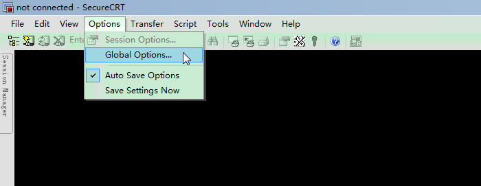
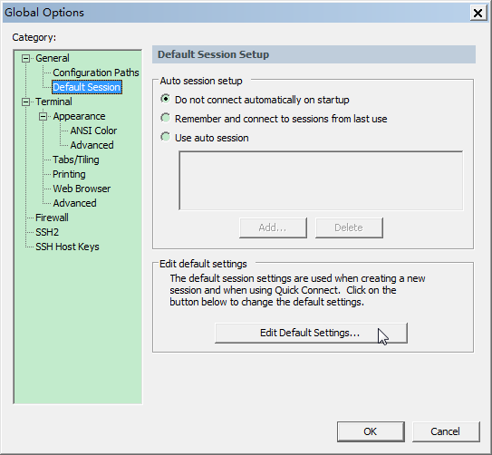
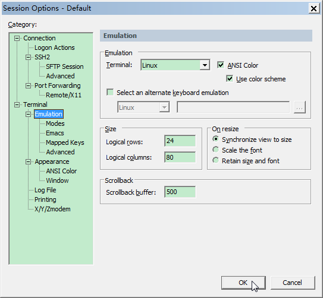
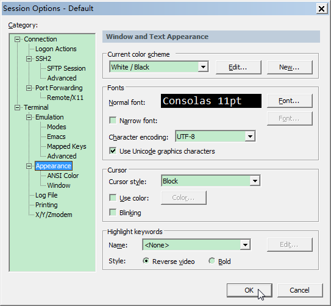
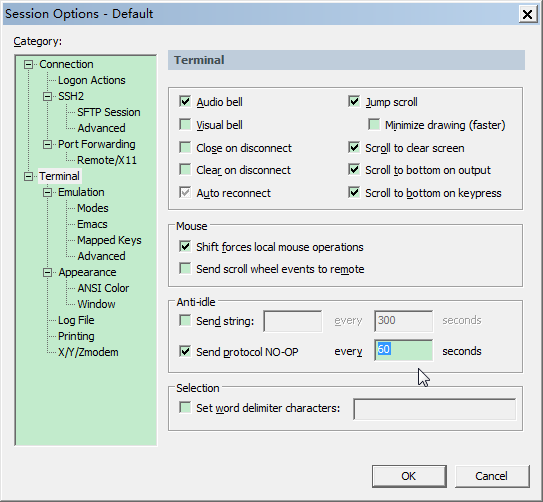
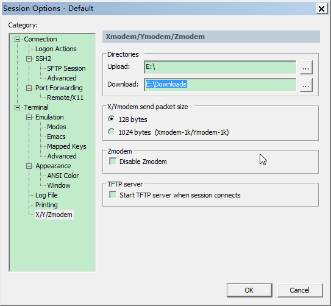
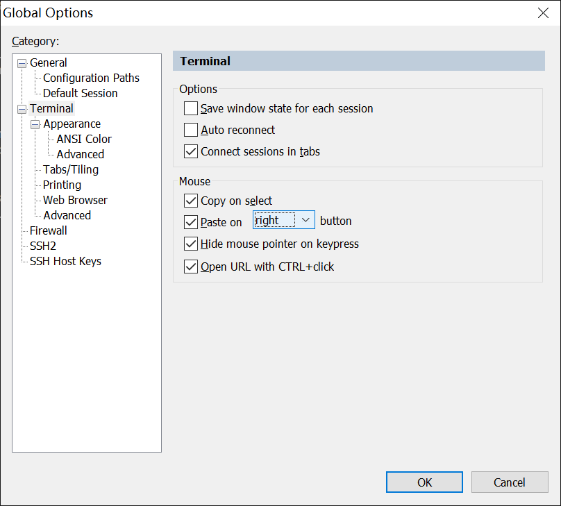

# SecureCRT设置

## 终端全局配置

直接修改全局选项，以免每加个服务器都要重新设置一次

编辑默认设置

设置仿真

设置字体和字符集

设置可以始终保持SecureCRT的连接

设置自带上传下载默认路径

设置右键粘贴

## 自带FTP上传下载

注：如果没有filezilla等工具，可以使用，但是传大文件时会造成Linux系统卡顿

- ALT+P：开启新的会话

- pwd: 查询linux主机所在目录

- lpwd: 查询本地目录（显示设置默认的上传路径）

- ls: 查询连接到当前linux主机所在目录有哪些文件

- lls: 查询当前本地上传目录有哪些文件

- lcd: 切换本地上传目录的路径

- cd: 切换远程上传目录

- get: 将远程目录中文件下载到本地目录

- put: 将本地目录中文件上传到远程主机（linux）