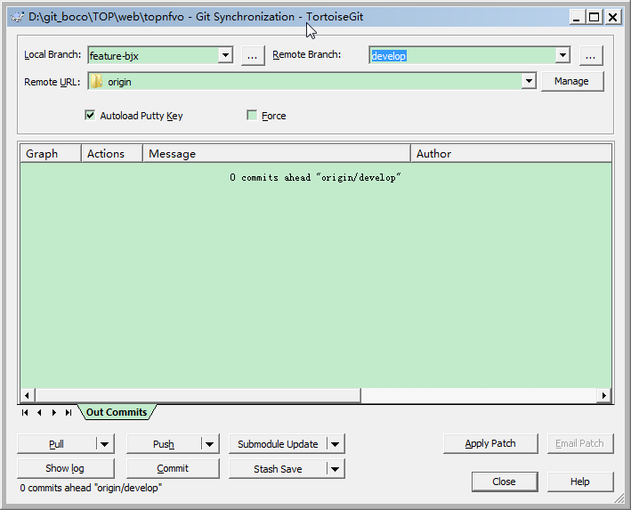
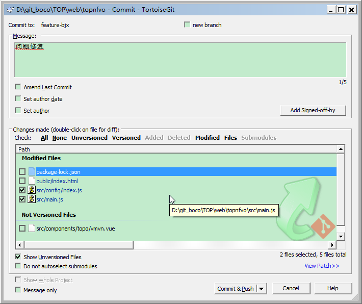
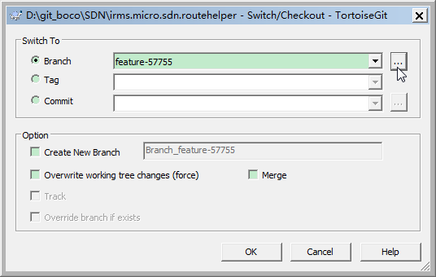
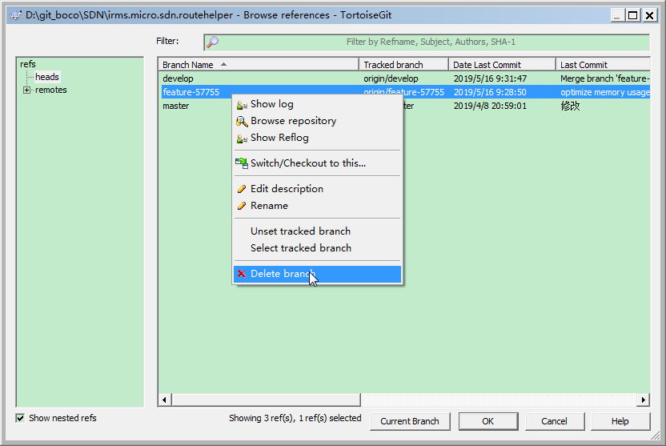
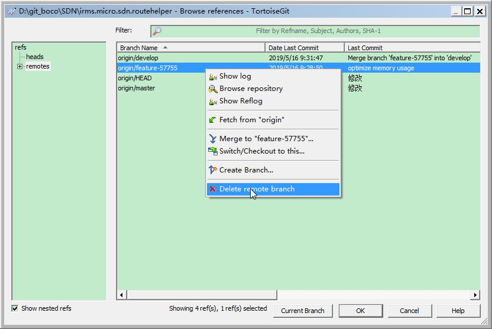

# TortoiseGit使用

## 设置TortoiseGit忽略SSL证书验证

TortoiseGit --> Setting --> Git --> Edit global .gitconfig 添加如下配置

```
[http]
sslVerify = false
```

Linux 下 git配置忽略SSL验证
```
git config --system http.sslverify false
```

## 克隆代码

1. 复制代码的链接
2. 在目标文件夹处鼠标右击，Git Clone，下载代码

## 切换分支
1. 右击代码 --> TortoiseGit --> Switch/Checkout --> 下拉选择目标Branch

## 拉取代码（Pull）
1. 右击代码 --> Git Sync
2. Remote Branch下拉选择最新代码分支
3. 点击Pull按钮拉取
4. 如果Pull时报有冲突（Conflict），点击Stash Save按钮先藏匿本地修改
5. 然后再点击Pull按钮拉取，之后再下拉Stash Save按钮处，选Stash Pop，尝试自动合并冲突代码
6. 如果还有冲突（Conflict），进入编辑器修改冲突，然后回到此界面，右击冲突文件，选择标记为Resolved



## 上传代码（Push）
1. 右击代码 --> Git Commit
2. 注意勾选Show Unversioned Files，防止新增文件漏提交
3. 切换Commit按钮未Commit & Push。Commit只提交到了本地分支，并未Push到Remote
4. 填写Message
5. 勾选要提交的文件
6. Commit & Push



## 清理分支
1. 右击代码 --> TortoiseGit --> Switch/Checkout，点击...按钮进入分支管理界面



1. 删除本地分支



2. 删除远端分支



## Branch 下拉列表清理
> 分支多了以后，Pull代码时切换Remote Branch很麻烦，需要清理

1. 进入注册表编辑：regedit
2. 搜索SyncBranch
3. 展开注册表结构，删除右边的分支项

