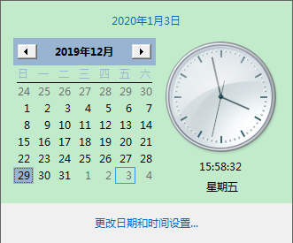

# 日期和String互转

通过SimpleDateFormat互转
```JAVA
SimpleDateFormat sdf1 = new SimpleDateFormat("yyyy-MM-dd HH:mm:ss");
Date date = null;
try{
    date = sdf1.parse("2019-12-29 09:00:00");
} catch (ParseException e) {
    e.printStackTrace();
}

SimpleDateFormat sdf2 = new SimpleDateFormat("YYYY-MM-dd HH:mm:ss");
System.out.println(sdf2.format(date)); // 2020-12-29 09:00:00
}
```
> 代码中的Y表示的是Week year，经过试验，得出的结果如下：Week year意思是当天所在的周所在的年份（一周从周日开始，周六结束），只要本周跨年，那么这周就算入下一年，例如2020-12-29，日历长成这样：



日期参数说明
```
yy: 年的后2位
yyyy: 完整年

MM: 月,显示为1-12.大写是因为要和分mm区分
MMM: 月,显示为英文月份简写,如 Jan,中文就是一月
MMMM: 月,显示为英文月份全称,如 Janualy,中文就是一月

d: 日,1-2位显示,如 2
dd: 日,2位数表示,如02

aa: 上下午,AM/PM

H: 时,1-2位显示,24小时制,0-23,大写是因为要和12小时制h区分
HH：时,2位数表示,24小时制,0-23
h: 时,1-2位显示,12小时制,1-12
hh：时,2位数表示,12小时制,1-12

K：时,12小时制,0-11
k：时,24小时制,1-24

m: 分,1-2位
mm: 分,2位

s: 秒,1-2位
ss: 秒,2位

S: 毫秒

常用日期结构：
        yyyy-MM-dd HH:mm:ss.SSS
        yyyy-MM-dd HH:mm:ss
        yyyy-MM-dd
```
