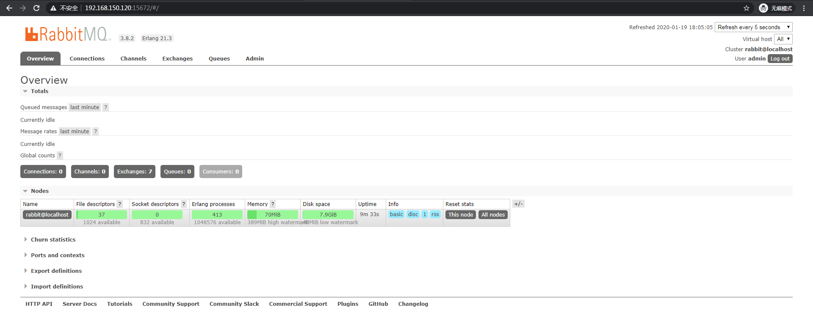

# RabbitMQ-3.8.0 单机版安装

## 一、前言
> Erlang和RabbitMQ的对应关系：http://www.rabbitmq.com/which-erlang.html

## 二、 安装Erlang环境

### 2.1 安装Erlang依赖
```
yum -y install make gcc gcc-c++ kernel-devel m4 ncurses-devel openssl-devel unixODBC unixODBC-devel httpd python-simplejson
```

### 2.2 安装Erlang环境

1. 下载Erlang源码
```
wget http://erlang.org/download/otp_src_21.3.tar.gz
```
2. 解压
```
tar -xvf otp_src_21.3.tar.gz
```
3. 配置
```
# cd otp_src_19.3
# ./configure --prefix=/usr/local/erlang --with-ssl --enable-threads --enable-smp-support --enable-kernel-poll --enable-hipe --without-javac

注：
–prefix 指定安装目录 

–enable-smp-support启用对称多处理支持（Symmetric Multi-Processing对称多处理结构的简称）

–enable-threads启用异步线程支持

–enable-sctp启用流控制协议支持（Stream Control Transmission Protocol，流控制传输协议）

–enable-kernel-poll启用Linux内核poll

–enable-hipe启用高性能Erlang

–with-ssl 启用ssl包

–without-javac 不用java编译
```
4. 编译安装
```
# make && make install
```
5. 配置Erlang的环境变量
```
# vim /etc/profile

文件末尾添加
export PATH=$PATH:/usr/local/erlang/bin

source /etc/profile
```
6. 测试安装成功

```
# erl
Erlang/OTP 21 [erts-10.3] [source] [64-bit] [smp:1:1] [ds:1:1:10] [async-threads:1] [hipe]

Eshell V10.3  (abort with ^G)
1> hello.
hello
2> halt().
#
```

## 三、安装RabbitMQ服务

### 3.1 下载
```
访问 https://www.rabbitmq.com/download.html
选择 https://www.rabbitmq.com/install-generic-unix.html

wget https://github.com/rabbitmq/rabbitmq-server/releases/download/v3.8.2/rabbitmq-server-generic-unix-3.8.2.tar.xz
```

### 3.2 解压
```
# xz -d rabbitmq-server-generic-unix-3.8.2.tar.xz
# tar -xvf rabbitmq-server-generic-unix-3.8.2.tar -C /usr/local/
```

### 3.3 设置环境变量
```
# vim /etc/profile

追加export PATH=$PATH:/usr/local/rabbitmq_server-3.8.0/sbin

# source /etc/profile

```

### 3.4 启动
```
# rabbitmq-server -detached
Warning: PID file not written; -detached was passed.
```

注：

- 启动服务：rabbitmq-server -detached   // -detached代表后台守护进程方式启动
- 查看状态：rabbitmqctl status
- 关闭服务：rabbitmqctl stop
- 列出角色：rabbitmqctl list_users

## 四、配置RabbitMQ监控插件
> 要使用浏览器访问RabbitMQ管理界面，则需要配置网页插件

### 4.1 启用插件
```
# rabbitmq-plugins enable rabbitmq_management
Enabling plugins on node rabbit@localhost:
rabbitmq_management
The following plugins have been configured:
  rabbitmq_management
  rabbitmq_management_agent
  rabbitmq_web_dispatch
Applying plugin configuration to rabbit@localhost...
Plugin configuration unchanged.
```

### 4.2 查看启动的插件
> [E*显示启动]   [e*隐式启动]
```
# rabbitmq-plugins list
Listing plugins with pattern ".*" ...
 Configured: E = explicitly enabled; e = implicitly enabled
 | Status: * = running on rabbit@localhost
 |/
[  ] rabbitmq_amqp1_0                  3.8.2
[  ] rabbitmq_auth_backend_cache       3.8.2
[  ] rabbitmq_auth_backend_http        3.8.2
[  ] rabbitmq_auth_backend_ldap        3.8.2
[  ] rabbitmq_auth_backend_oauth2      3.8.2
[  ] rabbitmq_auth_mechanism_ssl       3.8.2
[  ] rabbitmq_consistent_hash_exchange 3.8.2
[  ] rabbitmq_event_exchange           3.8.2
[  ] rabbitmq_federation               3.8.2
[  ] rabbitmq_federation_management    3.8.2
[  ] rabbitmq_jms_topic_exchange       3.8.2
[E*] rabbitmq_management               3.8.2
[e*] rabbitmq_management_agent         3.8.2
[  ] rabbitmq_mqtt                     3.8.2
[  ] rabbitmq_peer_discovery_aws       3.8.2
[  ] rabbitmq_peer_discovery_common    3.8.2
[  ] rabbitmq_peer_discovery_consul    3.8.2
[  ] rabbitmq_peer_discovery_etcd      3.8.2
[  ] rabbitmq_peer_discovery_k8s       3.8.2
[  ] rabbitmq_prometheus               3.8.2
[  ] rabbitmq_random_exchange          3.8.2
[  ] rabbitmq_recent_history_exchange  3.8.2
[  ] rabbitmq_sharding                 3.8.2
[  ] rabbitmq_shovel                   3.8.2
[  ] rabbitmq_shovel_management        3.8.2
[  ] rabbitmq_stomp                    3.8.2
[  ] rabbitmq_top                      3.8.2
[  ] rabbitmq_tracing                  3.8.2
[  ] rabbitmq_trust_store              3.8.2
[e*] rabbitmq_web_dispatch             3.8.2
[  ] rabbitmq_web_mqtt                 3.8.2
[  ] rabbitmq_web_mqtt_examples        3.8.2
[  ] rabbitmq_web_stomp                3.8.2
[  ] rabbitmq_web_stomp_examples       3.8.2
```
### 4.3 开放RabbitMQ管理端口15672
```
# firewall-cmd --zone=public --add-port=15672/tcp --permanent
# firewall-cmd --reload
```
### 4.4 浏览器访问
IP:15672
> 在浏览器中输入服务器IP:15672 就可以看到RabbitMQ的WEB管理页面了。默认情况下，访问RabbitMQ服务的用户名密码为“guest”，这个账户有限制， 默认只能通过本地网络访问，远程访问受到限制，所以我们需要新添加一个用户，命令如下
### 4.5 添加用户
```
--添加用户
# rabbitmqctl add_user admin 123456

--添加权限
# rabbitmqctl set_permissions -p / admin ".*" ".*" ".*"

--修改用户角色
rabbitmqctl set_user_tags admin administrator
```
### 4.6 输入账号密码登录




### 4.7 常用命令
```
# 添加用户
sudo rabbitmqctl add_user <username> <password>  
# 删除用户
sudo rabbitmqctl delete_user <username>  
# 修改用户密码
sudo rabbitmqctl change_password <username> <newpassword>  
# 清除用户密码（该用户将不能使用密码登陆，但是可以通过SASL登陆如果配置了SASL认证）
sudo rabbitmqctl clear_password <username> 
# 设置用户tags（相当于角色，包含administrator，monitoring，policymaker，management）
sudo rabbitmqctl set_user_tags <username> <tag>
# 列出所有用户
sudo rabbitmqctl list_users  
# 创建一个vhosts
sudo rabbitmqctl add_vhost <vhostpath>  
# 删除一个vhosts
sudo rabbitmqctl delete_vhost <vhostpath>  
# 列出vhosts
sudo rabbitmqctl list_vhosts [<vhostinfoitem> ...]  
# 针对一个vhosts给用户赋予相关权限；
sudo rabbitmqctl set_permissions [-p <vhostpath>] <user> <conf> <write> <read>  
# 清除一个用户对vhosts的权限；
sudo rabbitmqctl clear_permissions [-p <vhostpath>] <username>  
# 列出哪些用户可以访问该vhosts；
sudo rabbitmqctl list_permissions [-p <vhostpath>]   
# 列出用户访问权限；
sudo rabbitmqctl list_user_permissions <username>
```