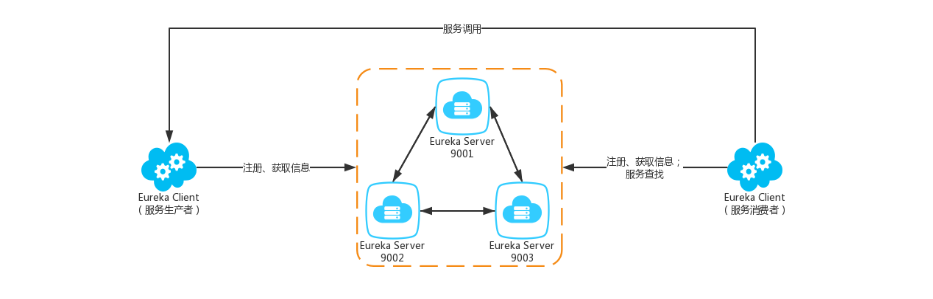
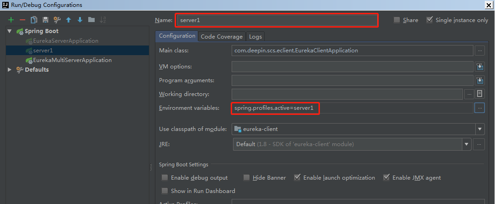
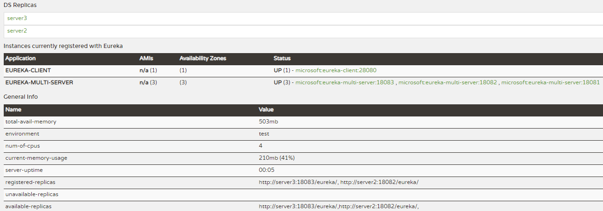
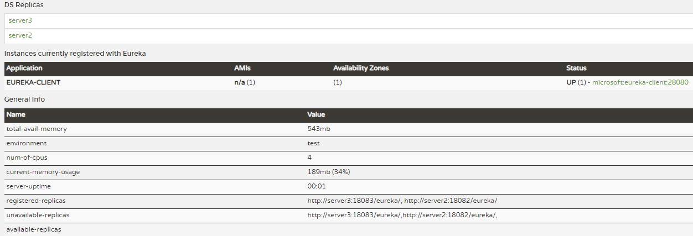

# EurekaServer高可用搭建
> Eureka Server除了单点运行之外，还可以通过运行多个实例，并进行互相注册的方式来实现高可用的部署和负载均衡。所以我们只需要将Eureke Server配置其他可用的 serviceUrl 就能实现高可用部署。部署图如下图所示：



## 设置hosts
> 通过设置不同主机名+端口模拟集群环境，生产上会部署到多个节点上
```
127.0.0.1 server1
127.0.0.1 server2
127.0.0.1 server3
```

## Server搭建
### pom.xml
```xml
<?xml version="1.0" encoding="UTF-8"?>
<project xmlns="http://maven.apache.org/POM/4.0.0"
         xmlns:xsi="http://www.w3.org/2001/XMLSchema-instance"
         xsi:schemaLocation="http://maven.apache.org/POM/4.0.0 http://maven.apache.org/xsd/maven-4.0.0.xsd">
    <modelVersion>4.0.0</modelVersion>

    <groupId>com.deepin</groupId>
    <artifactId>eureka-single-server</artifactId>
    <version>0.0.1-SNAPSHOT</version>
    <packaging>jar</packaging>

    <parent>
        <groupId>org.springframework.boot</groupId>
        <artifactId>spring-boot-starter-parent</artifactId>
        <version>2.1.7.RELEASE</version> <!-- lookup parent from repository -->
        <relativePath/>
    </parent>

    <properties>
        <project.build.sourceEncoding>UTF-8</project.build.sourceEncoding>
        <java.version>1.8</java.version>
        <spring-cloud.version>Greenwich.SR1</spring-cloud.version>
    </properties>

    <dependencies>
        <!-- eureka-server -->
        <dependency>
            <groupId>org.springframework.cloud</groupId>
            <artifactId>spring-cloud-starter-netflix-eureka-server</artifactId>
        </dependency>
    </dependencies>

    <dependencyManagement>
        <dependencies>
            <dependency>
                <groupId>org.springframework.cloud</groupId>
                <artifactId>spring-cloud-dependencies</artifactId>
                <version>${spring-cloud.version}</version>
                <type>pom</type>
                <scope>import</scope>
            </dependency>
        </dependencies>
    </dependencyManagement>

    <build>
        <plugins>
            <plugin>
            <groupId>org.springframework.boot</groupId>
            <artifactId>spring-boot-maven-plugin</artifactId>
        </plugin>
        </plugins>
    </build>

    <repositories>
        <repository>
            <id>spring-milestones</id>
            <name>Spring Milestones</name>
            <url>https://repo.spring.io/milestone</url>
        </repository>
    </repositories>

</project>
```

### application.yml
> 注意缩进，否则启动时报各种奇怪的问题
```yml
spring:
  application:
    name: eureka-multi-server
  profiles:
    active: server1
```

### application-server1.yml
```yml
server:
  port: 18081
eureka:
  instance:
    #指定当profile=server1时,主机名是server1
    hostname: server1
  client:
    register-with-eureka: true #一定要设置为true或者不写,否则会出现unavailable-replicas
    fetch-registry: true #一定要设置为true或者不写,否则会出现unavailable-replicas
    service-url:
      #将自己注册到其他eureka服务上
      defaultZone: http://server2:18082/eureka/, http://server3:18083/eureka/
```

### application-server2.yml
```yml
server:
  port: 18082
eureka:
  instance:
    #指定当profile=server2时,主机名是server2
    hostname: server2
  client:
    register-with-eureka: true #一定要设置为true或者不写,否则会出现unavailable-replicas
    fetch-registry: true #一定要设置为true或者不写,否则会出现unavailable-replicas
    service-url:
      defaultZone: http://server1:18082/eureka/, http://server3:18083/eureka/
```

### application-server3.yml
```yml
server:
  port: 18083
eureka:
  instance:
    #指定当profile=server3时,主机名是server3
    hostname: server3
  client:
    register-with-eureka: true #一定要设置为true或者不写,否则会出现unavailable-replicas
    fetch-registry: true #一定要设置为true或者不写,否则会出现unavailable-replicas
    service-url:
      defaultZone: http://server1:18081/eureka/, http://server2:18082/eureka/
```

### 启动类
```java
import org.springframework.boot.SpringApplication;
import org.springframework.boot.autoconfigure.SpringBootApplication;
import org.springframework.cloud.netflix.eureka.EnableEurekaClient;

@SpringBootApplication
@EnableEurekaClient
public class EurekaClientApplication {
    public static void main(String[] args) {
        SpringApplication.run(EurekaClientApplication.class, args);
    }
}
```

## Client搭建

### pom.xml
```xml
<?xml version="1.0" encoding="UTF-8"?>
<project xmlns="http://maven.apache.org/POM/4.0.0"
         xmlns:xsi="http://www.w3.org/2001/XMLSchema-instance"
         xsi:schemaLocation="http://maven.apache.org/POM/4.0.0 http://maven.apache.org/xsd/maven-4.0.0.xsd">
    <modelVersion>4.0.0</modelVersion>

    <groupId>com.deepin</groupId>
    <artifactId>eureka-consumer</artifactId>
    <version>0.0.1-SNAPSHOT</version>
    <packaging>jar</packaging>

    <parent>
        <groupId>org.springframework.boot</groupId>
        <artifactId>spring-boot-starter-parent</artifactId>
        <version>2.1.7.RELEASE</version> <!-- lookup parent from repository -->
        <relativePath/>
    </parent>

    <properties>
        <project.build.sourceEncoding>UTF-8</project.build.sourceEncoding>
        <java.version>1.8</java.version>
        <spring-cloud.version>Greenwich.SR1</spring-cloud.version>
    </properties>

    <dependencies>
        <!-- eureka-client -->
        <dependency>
            <groupId>org.springframework.boot</groupId>
            <artifactId>spring-boot-starter-web</artifactId>
        </dependency>
        <!-- eureka-client -->
        <dependency>
            <groupId>org.springframework.cloud</groupId>
            <artifactId>spring-cloud-starter-netflix-eureka-client</artifactId>
        </dependency>
    </dependencies>

    <dependencyManagement>
        <dependencies>
            <dependency>
                <groupId>org.springframework.cloud</groupId>
                <artifactId>spring-cloud-dependencies</artifactId>
                <version>${spring-cloud.version}</version>
                <type>pom</type>
                <scope>import</scope>
            </dependency>
        </dependencies>
    </dependencyManagement>

    <build>
        <plugins>
            <plugin>
                <groupId>org.springframework.boot</groupId>
                <artifactId>spring-boot-maven-plugin</artifactId>
            </plugin>
        </plugins>
    </build>

</project>
```

### application.yml
```yml
server:
  port: 28080
spring:
  application:
    name: eureka-client
eureka:
  client:
    register-with-eureka: true
    fetch-registry: true
    serviceUrl:
      defaultZone: http://server1:18081/eureka/,http://server2:18082/eureka/,http://server3:18083/eureka/
```

### 启动类
```java
import org.springframework.boot.SpringApplication;
import org.springframework.boot.autoconfigure.SpringBootApplication;
import org.springframework.cloud.netflix.eureka.EnableEurekaClient;

@SpringBootApplication
@EnableEurekaClient
public class EurekaClientApplication {
    public static void main(String[] args) {
        SpringApplication.run(EurekaClientApplication.class, args);
    }
}
```

## 打包部署
```
java -jar eureka-multi-server-0.0.1-SNAPSHOT.jar --spring.profiles.active=server1
java -jar eureka-multi-server-0.0.1-SNAPSHOT.jar --spring.profiles.active=server2
java -jar eureka-multi-server-0.0.1-SNAPSHOT.jar --spring.profiles.active=server3

java -jar eureka-consumer-0.0.1-SNAPSHOT.jar
```

> idea根据不同配置文件启动的设置方法



## 查看注册情况



## 设置register-with-eureka: false/true的区别
> 设置register-with-eureka: false后，server依旧能进行client发现，但是会出现unavailable-replicas(不可用分片)


