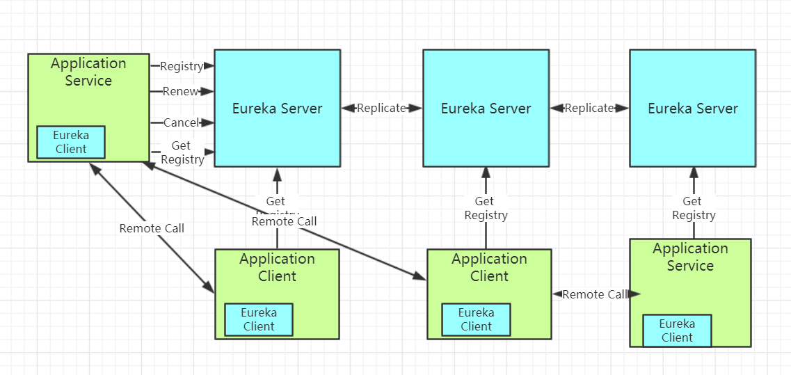
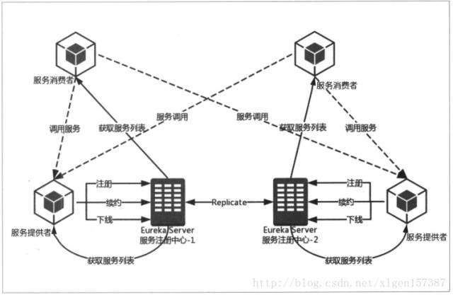

# Eureka简介

## 技术架构
Eureka 是 Netflix 开发的，一个基于 REST 服务的，服务注册与发现的组件
它主要包括两个组件：Eureka Server 和 Eureka Client

- Eureka Client：一个Java客户端，用于简化与 Eureka Server 的交互（通常就是微服务中的客户端和服务端）

- Eureka Server：提供服务注册和发现的能力（通常就是微服务中的注册中心）

各个微服务启动时，会通过 Eureka Client 向 Eureka Server 注册自己，Eureka Server 会存储该服务的信息

也就是说，每个微服务的客户端和服务端，都会注册到 Eureka Server，这就衍生出了微服务相互识别的话题

- 同步：每个 Eureka Server 同时也是 Eureka Client（逻辑上的）。多个 Eureka Server 之间通过复制的方式完成服务注册表的同步，形成 Eureka 的高可用
- 识别：Eureka Client 会缓存 Eureka Server 中的信息。即使所有 Eureka Server 节点都宕掉，服务消费者仍可使用缓存中的信息找到服务提供者（笔者已亲测）
- 续约：微服务会周期性（默认30s）地向 Eureka Server 发送心跳以Renew（续约）信息（类似于heartbeat）
- 续期：Eureka Server 会定期（默认60s）执行一次失效服务检测功能，它会检查超过一定时间（默认90s）没有Renew的微服务，发现则会注销该微服务节点

Spring Cloud 已经把 Eureka 集成在其子项目 Spring Cloud Netflix 里面

## 逻辑架构

eueka按逻辑上可以划分为3个模块，eureka-server，service-provider，service-consumer
- eureka-server：服务端，提供服务注册和发现
- eureka-client-service-provider：服务端，服务提供者，通过http rest告知服务端注册，更新，取消服务
- eureka-client-service-consumer：客户端，服务消费者，通过http rest从服务端获取需要服务的地址列表，然后配合一些负载均衡策略（ribbon）来调用服务端服务。

