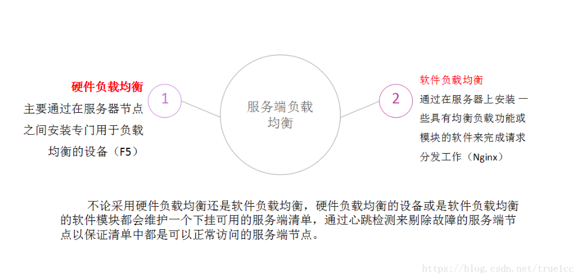
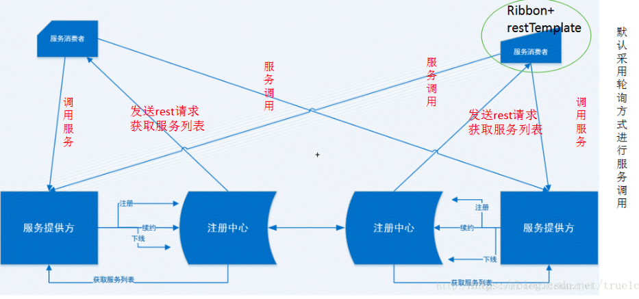

# Ribbon简介

## 简介

Spring Cloud Ribbon 是一个基于ＨTTP和TCP的客户端负载均衡工具，它基于Netflix Ribbon实现。通过 Spring Cloud 的封装， 可以让我们轻松地将面向服务的 REST 模板请求自动转换成客户端负载均衡的服务调用。在微服务架构中，业务都会被拆分成一个独立的服务，服务与服务的通讯是基于http restful的。Spring cloud有两种服务调用方式，一种是ribbon+restTemplate，另一种是feign。

一般说的 负载均衡 是指 服务器端的负载均衡（硬件负载均衡、软件负载均衡）

而 客户端负载均衡 和 服务端负载均衡 最大的不同点在上面所提到的 服务清单所存储的位置。 在客户端负载均衡中，所有客户端节点都维护着自己要访问的服务端清单 而这些服务端的清单来自于服务注册中心（Eureka服务端）。

同服务端负载均衡的架构类似， 在客户端负载均衡中也需要心跳去维护服务端清单的健康性， 只是这个步骤需要与服务注册中心配合完成。

在Spring Cloud中我们如果想要使用客户端负载均衡，方法很简单，开启 @LoadBalanced 注解即可，这样客户端在发起请求的时候会先自行选择一个服务端，向该服务端发起请求，从而实现负载均衡。

## Ribbon的核心组件

### ServerList
用于获取地址列表。它既可以是静态的(提供一组固定的地址)，也可以是动态的(从注册中心中定期查询地址列表)。

### ServerListFilter
仅当使用动态ServerList时使用，用于在原始的服务列表中使用一定策略过虑掉一部分地址。

### IRule
选择一个最终的服务地址作为LB结果。选择策略有轮询、根据响应时间加权、断路器(当Hystrix可用时)等。
Ribbon在工作时首选会通过ServerList来获取所有可用的服务列表，然后通过ServerListFilter过虑掉一部分地址，最后在剩下的地址中通过IRule选择出一台服务器作为最终结果。

## Ribbon提供的主要负载均衡策略介绍
- 简单轮询负载均衡（RoundRobin）

  以轮询的方式依次将请求调度不同的服务器，即每次调度执行i = (i + 1) mod n，并选出第i台服务器。

- 随机负载均衡 （Random）

  随机选择状态为UP的Server

- 加权响应时间负载均衡 （WeightedResponseTime）

   根据相应时间分配一个weight，相应时间越长，weight越小，被选中的可能性越低。

- 区域感知轮询负载均衡（ZoneAvoidanceRule）

   复合判断server所在区域的性能和server的可用性选择server