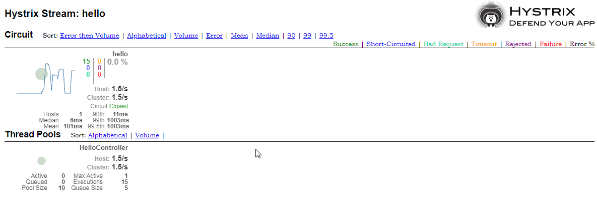

# Hystrix Dashboard搭建

## pom.xml
> 注意添加spring-boot-starter-actuator和spring-cloud-starter-netflix-hystrix-dashboard
```xml
<?xml version="1.0" encoding="UTF-8"?>
<project xmlns="http://maven.apache.org/POM/4.0.0"
         xmlns:xsi="http://www.w3.org/2001/XMLSchema-instance"
         xsi:schemaLocation="http://maven.apache.org/POM/4.0.0 http://maven.apache.org/xsd/maven-4.0.0.xsd">
    <modelVersion>4.0.0</modelVersion>

    <groupId>com.deepin</groupId>
    <artifactId>hystrix-dashboard</artifactId>
    <version>0.0.1-SNAPSHOT</version>
    <packaging>jar</packaging>

    <parent>
        <groupId>org.springframework.boot</groupId>
        <artifactId>spring-boot-starter-parent</artifactId>
        <version>2.1.7.RELEASE</version> <!-- lookup parent from repository -->
        <relativePath/>
    </parent>

    <properties>
        <project.build.sourceEncoding>UTF-8</project.build.sourceEncoding>
        <java.version>1.8</java.version>
        <spring-cloud.version>Greenwich.SR1</spring-cloud.version>
    </properties>

    <dependencies>
        <dependency>
            <groupId>org.springframework.boot</groupId>
            <artifactId>spring-boot-starter-web</artifactId>
        </dependency>
        <dependency>
            <groupId>org.springframework.cloud</groupId>
            <artifactId>spring-cloud-starter-netflix-ribbon</artifactId>
        </dependency>
        <dependency>
            <groupId>org.springframework.cloud</groupId>
            <artifactId>spring-cloud-starter-netflix-eureka-client</artifactId>
        </dependency>
        <dependency>
            <groupId>org.springframework.cloud</groupId>
            <artifactId>spring-cloud-starter-netflix-hystrix</artifactId>
        </dependency>
        <dependency>
            <groupId>org.springframework.boot</groupId>
            <artifactId>spring-boot-starter-actuator</artifactId>
        </dependency>
        <dependency>
            <groupId>org.springframework.cloud</groupId>
            <artifactId>spring-cloud-starter-netflix-hystrix-dashboard</artifactId>
        </dependency>
    </dependencies>

    <dependencyManagement>
        <dependencies>
            <dependency>
                <groupId>org.springframework.cloud</groupId>
                <artifactId>spring-cloud-dependencies</artifactId>
                <version>${spring-cloud.version}</version>
                <type>pom</type>
                <scope>import</scope>
            </dependency>
        </dependencies>
    </dependencyManagement>

    <build>
        <plugins>
            <plugin>
                <groupId>org.springframework.boot</groupId>
                <artifactId>spring-boot-maven-plugin</artifactId>
            </plugin>
        </plugins>
    </build>

</project>
```

### application.yml
```yml
spring:
  application:
    name: hystrix-dashboard

server:
  port: 48081

# Actuator默认只启动了health和info 端点，如此要想访问hystrix.stream链接 ，则需配置开放相应端点，端点可指定或全部打开"*"
management:
  endpoints:
    web:
      exposure:
        include: "*"

eureka:
  client:
    register-with-eureka: true
    fetch-registry: true
    service-url:
      defaultZone: http://localhost:18080/eureka/
```

### HystrixDashboardApplication
> 添加注解@EnableHystrixDashboard
```java
@EnableHystrix
@EnableHystrixDashboard
@EnableEurekaClient
@SpringBootApplication
public class HystrixDashboardApplication {
    @Bean
    @LoadBalanced
    RestTemplate restTemplate() {
        return new RestTemplate();
    }

    public static void main(String[] args) {
        SpringApplication.run(HystrixDashboardApplication.class, args);
    }

}
```

### HelloService
> 参考Hystrix搭建的HelloService

### HelloController
> 参考Hystrix搭建的HelloController

## 测试结果
- 启动eureka
- 启动三个service provider
- 启动hystrix-dashboard

> erueka注册情况：


> 添加监控：http://localhost:48081/hystrix 。界面依次输入参数http://localhost:48081/actuator/hystrix.stream， 2000，hello点确定，进入图形化界面。


> 图形化界面需要加载一段时间。刷新页面调用接口，可以看到波动：http://localhost:48081/hello?name=zhangsan




