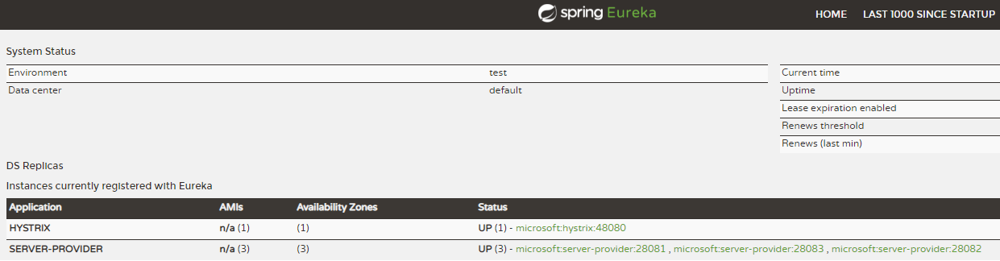
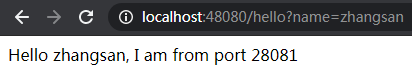
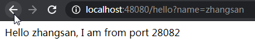
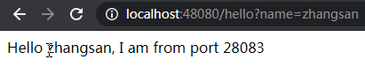
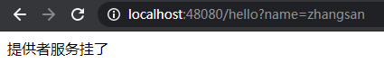

# Hystrix搭建

## Eureka搭建
> 参考Eureka Server单节点

## Server Provider搭建
> 参考Ribbon的Server Provider搭建

## Hystrix搭建

### pom.xml
> 注意添加spring-cloud-starter-netflix-ribbon和spring-cloud-starter-netflix-hystrix
```xml
<?xml version="1.0" encoding="UTF-8"?>
<project xmlns="http://maven.apache.org/POM/4.0.0"
         xmlns:xsi="http://www.w3.org/2001/XMLSchema-instance"
         xsi:schemaLocation="http://maven.apache.org/POM/4.0.0 http://maven.apache.org/xsd/maven-4.0.0.xsd">
    <modelVersion>4.0.0</modelVersion>

    <groupId>com.deepin</groupId>
    <artifactId>hystrix</artifactId>
    <version>0.0.1-SNAPSHOT</version>
    <packaging>jar</packaging>

    <parent>
        <groupId>org.springframework.boot</groupId>
        <artifactId>spring-boot-starter-parent</artifactId>
        <version>2.1.7.RELEASE</version> <!-- lookup parent from repository -->
        <relativePath/>
    </parent>

    <properties>
        <project.build.sourceEncoding>UTF-8</project.build.sourceEncoding>
        <java.version>1.8</java.version>
        <spring-cloud.version>Greenwich.SR1</spring-cloud.version>
    </properties>

    <dependencies>
        <dependency>
            <groupId>org.springframework.boot</groupId>
            <artifactId>spring-boot-starter-web</artifactId>
        </dependency>
        <dependency>
            <groupId>org.springframework.cloud</groupId>
            <artifactId>spring-cloud-starter-netflix-ribbon</artifactId>
        </dependency>
        <dependency>
            <groupId>org.springframework.cloud</groupId>
            <artifactId>spring-cloud-starter-netflix-eureka-client</artifactId>
        </dependency>
        <dependency>
            <groupId>org.springframework.cloud</groupId>
            <artifactId>spring-cloud-starter-netflix-hystrix</artifactId>
        </dependency>
    </dependencies>

    <dependencyManagement>
        <dependencies>
            <dependency>
                <groupId>org.springframework.cloud</groupId>
                <artifactId>spring-cloud-dependencies</artifactId>
                <version>${spring-cloud.version}</version>
                <type>pom</type>
                <scope>import</scope>
            </dependency>
        </dependencies>
    </dependencyManagement>

    <build>
        <plugins>
            <plugin>
                <groupId>org.springframework.boot</groupId>
                <artifactId>spring-boot-maven-plugin</artifactId>
            </plugin>
        </plugins>
    </build>

</project>
```

### application.yml
```yml
spring:
  application:
    name: hystrix

server:
  port: 48080

eureka:
  client:
    register-with-eureka: true
    fetch-registry: true
    service-url:
      defaultZone: http://localhost:18080/eureka/
```

### HystrixServerApplication
> 添加注解@EnableHystrix
```java
@EnableHystrix
@EnableEurekaClient
@SpringBootApplication
public class HystrixServerApplication {
    @Bean
    @LoadBalanced
    RestTemplate restTemplate() {
        return new RestTemplate();
    }

    public static void main(String[] args) {
        SpringApplication.run(HystrixServerApplication.class, args);
    }

}
```

### HelloService
```java
@Service
public class HelloService {

    @Autowired
    RestTemplate restTemplate;

    public String hello(String name) {
        // URL使用服务别名
        return restTemplate.getForObject("http://server-provider/" + "hello?name=" + name, String.class);
    }
}
```

### HelloController
> defaultStores的参数列表要和hello方法保持一致，否则会出现异常 fallback method wasn't found
```java
@RestController
@RestController
public class HelloController {

    @Autowired
    HelloService helloService;

    @HystrixCommand(fallbackMethod = "defaultStores")
    @RequestMapping("/hello")
    public String hello(@RequestParam("name") String name) {
        return helloService.hello(name);
    }

    public String defaultStores(String name) {
        return "提供者服务挂了";
    }

}
```

@HystrixCommand 表明该方法为hystrix包裹，可以对依赖服务进行隔离、降级、快速失败、快速重试等等hystrix相关功能
该注解属性较多，下面讲解其中几个

- fallbackMethod 降级方法
- commandProperties 普通配置属性，可以配置HystrixCommand对应属性，例如采用线程池还是信号量隔离、熔断器熔断规则等等
- ignoreExceptions 忽略的异常，默认HystrixBadRequestException不计入失败
- groupKey() 组名称，默认使用类名称
- commandKey 命令名称，默认使用方法名

## 测试结果
- 启动eureka
- 启动三个service provider
- 启动hystrix

> erueka注册情况：



> 通过Ribbon调用服务接口，刷新获得不同的结果：http://localhost:48080/hello?name=zhangsan







> 关闭server1，刷新，server2和server3正常，server1看到错误提示信息。再过一会儿，只能访问到server2和server3

