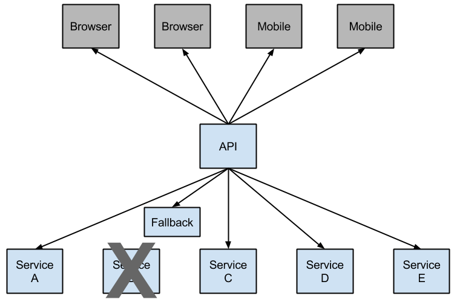

# Hystrix简介

## 场景需求
在微服务架构中，根据业务来拆分成一个个的服务。为了保证其高可用，单个服务通常会集群部署。由于网络原因或者自身的原因，服务并不能保证100%可用，如果单个服务出现问题，调用这个服务就会出现线程阻塞，此时若有大量的请求涌入，Servlet容器的线程资源会被消耗完毕，导致服务瘫痪。服务与服务之间的依赖性，故障会传播，会对整个微服务系统造成灾难性的严重后果，这就是服务故障的“雪崩”效应。

例如一个依赖30个SOA服务的系统,每个服务99.99%可用。  99.99%的30次方 ≈ 99.7%  。0.3% 意味着一亿次请求 会有 3,000,00次失败。换算成时间大约每月有2个小时服务不稳定。随着服务依赖数量的变多，服务不稳定的概率会成指数性提高。

针对上述问题，在Spring Cloud Hystrix中实现了线程隔离、断路器等一系列的服务保护功能。它也是基于Netflix的开源框架 Hystrix实现的，该框架目标在于通过控制那些访问远程系统、服务和第三方库的节点，从而对延迟和故障提供更强大的容错能力。Hystrix具备了服务降级、服务熔断、线程隔离、请求缓存、请求合并以及服务监控等强大功能。

## 逻辑架构
在分布式架构中，当某个服务单元发生故障（类似用电器发生短路）之后，通过断路器的故障监控（类似熔断保险丝），向调用方返回一个错误响应，而不是长时间的等待。这样就不会使得线程因调用故障服务被长时间占用不释放，避免了故障在分布式系统中的蔓延。

在微服务架构下，通常会有多个层次的服务调用。一个微服务的超时失败可能导致瀑布式连锁反映，下图中，Hystrix通过自主反馈实现的断路器， 防止了这种情况发生。

图中的服务B因为某些原因失败，变得不可用，所有对服务B的调用都会超时。当对B的调用失败达到一个特定的阀值(5秒之内发生20次失败是Hystrix定义的缺省值), 链路就会被处于open状态， 之后所有所有对服务B的调用都不会被执行， 取而代之的是由断路器提供的一个表示链路open的Fallback消息. Hystrix提供了相应机制，可以让开发者定义这个Fallbak消息.

open的链路阻断了瀑布式错误， 可以让被淹没或者错误的服务有时间进行修复。这个fallback可以是另外一个Hystrix保护的调用, 静态数据，或者合法的空值. Fallbacks可以组成链式结构，所以，最底层调用其它业务服务的第一个Fallback返回静态数据。

## Hystrix Dashboard
Hystrix Dashboard是作为断路器状态的一个组件，提供了数据监控和友好的图形化界面。