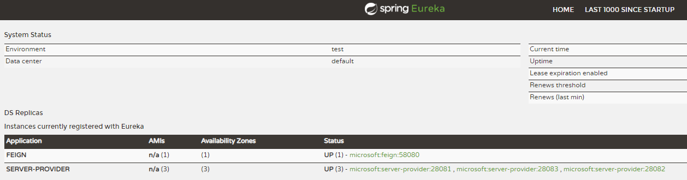
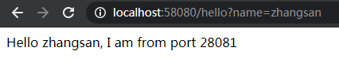
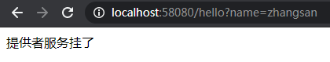

# Feign搭建

## Eureka搭建
> 参考Eureka Server单节点

## Server Provider搭建
> 参考Ribbon的Server Provider搭建

## Feign搭建

### pom.xml
> 注意添加spring-cloud-starter-openfeign
```xml
<?xml version="1.0" encoding="UTF-8"?>
<project xmlns="http://maven.apache.org/POM/4.0.0"
         xmlns:xsi="http://www.w3.org/2001/XMLSchema-instance"
         xsi:schemaLocation="http://maven.apache.org/POM/4.0.0 http://maven.apache.org/xsd/maven-4.0.0.xsd">
    <modelVersion>4.0.0</modelVersion>

    <groupId>com.deepin</groupId>
    <artifactId>feign</artifactId>
    <version>0.0.1-SNAPSHOT</version>
    <packaging>jar</packaging>

    <parent>
        <groupId>org.springframework.boot</groupId>
        <artifactId>spring-boot-starter-parent</artifactId>
        <version>2.1.7.RELEASE</version> <!-- lookup parent from repository -->
        <relativePath/>
    </parent>

    <properties>
        <project.build.sourceEncoding>UTF-8</project.build.sourceEncoding>
        <java.version>1.8</java.version>
        <spring-cloud.version>Greenwich.SR1</spring-cloud.version>
    </properties>

    <dependencies>
        <dependency>
            <groupId>org.springframework.boot</groupId>
            <artifactId>spring-boot-starter-web</artifactId>
        </dependency>
        <dependency>
            <groupId>org.springframework.cloud</groupId>
            <artifactId>spring-cloud-starter-openfeign</artifactId>
        </dependency>
        <dependency>
            <groupId>org.springframework.cloud</groupId>
            <artifactId>spring-cloud-starter-netflix-eureka-client</artifactId>
        </dependency>
    </dependencies>

    <dependencyManagement>
        <dependencies>
            <dependency>
                <groupId>org.springframework.cloud</groupId>
                <artifactId>spring-cloud-dependencies</artifactId>
                <version>${spring-cloud.version}</version>
                <type>pom</type>
                <scope>import</scope>
            </dependency>
        </dependencies>
    </dependencyManagement>

    <build>
        <plugins>
            <plugin>
                <groupId>org.springframework.boot</groupId>
                <artifactId>spring-boot-maven-plugin</artifactId>
            </plugin>
        </plugins>
    </build>

</project>
```

### application.yml
```yml
spring:
  application:
    name: feign

server:
  port: 58080

feign:
  hystrix:
    enabled: true

eureka:
  client:
    register-with-eureka: true
    fetch-registry: true
    service-url:
      defaultZone: http://localhost:18080/eureka/
```

### FeignServerApplication
> 注意开启@EnableFeignClients
```java
@EnableFeignClients
@EnableEurekaClient
@SpringBootApplication
public class FeignServerApplication {

    public static void main(String[] args) {
        SpringApplication.run(FeignServerApplication.class, args);
    }

}
```

### HystrixClientFallbackFactory
```java
@Component
public class HystrixClientFallbackFactory implements FallbackFactory<ServerProviderClient> {

    @Override
    public ServerProviderClient create(Throwable throwable) {
        return (String name) -> "提供者服务挂了";
    }

}
```

### ServerProviderClient
```java
@FeignClient(value = "server-provider", fallbackFactory = HystrixClientFallbackFactory.class)
@Repository
public interface ServerProviderClient {

    @RequestMapping(value = "/hello") // 必须指定RequestMapping的值
    String hello(@RequestParam("name") String name); // 同时RequestParam也需要指定，否则报feign.FeignException: status 400

}
```

### HelloController
```java
@RestController
public class HelloController {

    @Autowired
    ServerProviderClient serverProviderClient;

    @RequestMapping(value = "/hello")
    public String hello(String name) {
        return serverProviderClient.hello(name);
    }

}
```

## 测试结果
- 启动eureka
- 启动三个service provider
- 启动feign

> erueka注册情况：



> 通过feign访问接口服务，刷新，查看feign实现负载均衡



> 关闭所有的server，刷新，看到错误提示信息


