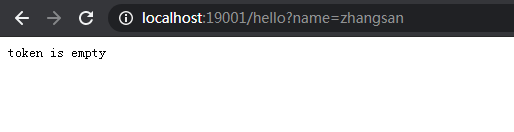
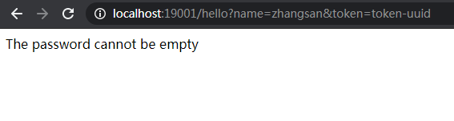
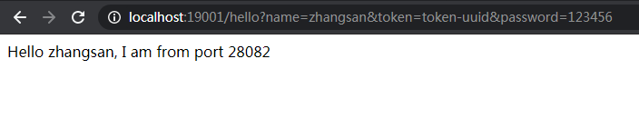

# ZuulFilter搭建
> 通过ZuulFilter ，我们可以实现安全控制，比如，只有请求参数中有token和密码的客户端才能访问服务端的资源

## ZuulFilter搭建
> 参考Zuul搭建

### application.yml
```yml
spring:
  application:
    name: zuul-filter

server:
  port: 19001

zuul:
  routes:
    api:
      path: /**
      serviceId: server-provider

eureka:
  client:
    register-with-eureka: true
    fetch-registry: true
    service-url:
      defaultZone: http://localhost:18080/eureka/
```

### TokenFilter
```java
public class TokenFilter extends ZuulFilter {

    private final Logger LOGGER = LoggerFactory.getLogger(TokenFilter.class);

    @Override
    public String filterType() {
        return "pre"; // 可以在请求被路由之前调用
    }

    @Override
    public int filterOrder() {
        return 0; // filter执行顺序，通过数字指定 ,优先级为0，数字越大，优先级越低
    }

    @Override
    public boolean shouldFilter() {
        return true; // 是否执行该过滤器，此处为true，说明需要过滤
    }

    @Override
    public Object run() {
        RequestContext ctx = RequestContext.getCurrentContext();
        HttpServletRequest request = ctx.getRequest();

        LOGGER.info("--->>> TokenFilter {},{}", request.getMethod(), request.getRequestURL().toString());

        String token = request.getParameter("token");// 获取请求的参数

        if (StringUtils.isNotBlank(token)) {
            ctx.setSendZuulResponse(true); //对请求进行路由
            ctx.setResponseStatusCode(200);
            ctx.set("isSuccess", true);
            return null;
        } else {
            ctx.setSendZuulResponse(false); //不对其进行路由
            ctx.setResponseStatusCode(400);
            ctx.setResponseBody("token is empty");
            ctx.set("isSuccess", false);
            return null;
        }
    }

}
```

### PasswordFilter
```java
public class PasswordFilter extends ZuulFilter {

    private final Logger LOGGER = LoggerFactory.getLogger(TokenFilter.class);

    @Override
    public String filterType() {
        return "post"; // 请求处理完成后执行的filter
    }

    @Override
    public int filterOrder() {
        return 1; // 优先级为0，数字越大，优先级越低
    }

    @Override
    public boolean shouldFilter() {
        RequestContext ctx = RequestContext.getCurrentContext();
        return (boolean) ctx.get("isSuccess");
        // 判断上一个过滤器结果为true，否则就不走下面过滤器，直接跳过后面的所有过滤器并返回 上一个过滤器不通过的结果。
    }

    @Override
    public Object run() {
        RequestContext ctx = RequestContext.getCurrentContext();
        HttpServletRequest request = ctx.getRequest();

        LOGGER.info("--->>> PasswordFilter {},{}", request.getMethod(), request.getRequestURL().toString());

        String username = request.getParameter("password");
        if (null != username && username.equals("123456")) {
            ctx.setSendZuulResponse(true);
            ctx.setResponseStatusCode(200);
            ctx.set("isSuccess", true);
            return null;
        } else {
            ctx.setSendZuulResponse(false);
            ctx.setResponseStatusCode(400);
            ctx.setResponseBody("The password cannot be empty");
            ctx.set("isSuccess", false);
            return null;
        }
    }

}
```

### ZuulFilterApplication
> 注意注入bean
```java
@SpringBootApplication
@EnableZuulProxy
public class ZuulFilterApplication {
    @Bean
    public TokenFilter tokenFilter() {
        return new TokenFilter();
    }

    @Bean
    public PasswordFilter PasswordFilter() {
        return new PasswordFilter();
    }

    public static void main(String[] args) {
        SpringApplication.run(ZuulFilterApplication.class, args);
    }
}
```

## 测试结果
- 启动eureka
- 启动三个service provider
- 启动zuul-filter

> 通过zuul直接访问接口服务，提示token不能为空： http://localhost:19001/hello?name=zhangsan



> 只添加token，提示密码不正确：http://localhost:19001/hello?name=zhangsan&token=token-uuid



> 添加token和密码，请求返回服务响应内容：http://localhost:19001/hello?name=zhangsan&token=token-uuid&password=123456

