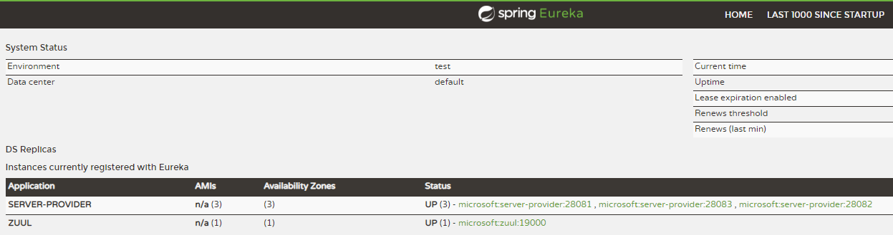
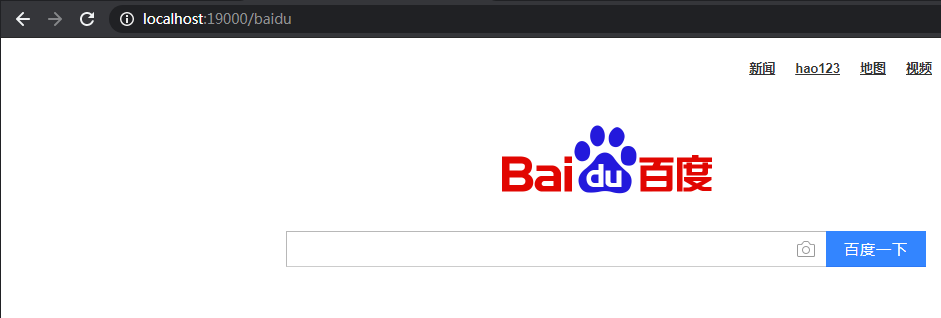
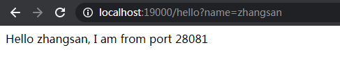

# Zuul搭建

## Eureka搭建
> 参考Eureka Server单节点

## Server Provider搭建
> 参考Ribbon的Server Provider搭建

## Zuul搭建

### pom.xml
> 注意添加spring-cloud-starter-netflix-zuul
```xml
<?xml version="1.0" encoding="UTF-8"?>
<project xmlns="http://maven.apache.org/POM/4.0.0"
         xmlns:xsi="http://www.w3.org/2001/XMLSchema-instance"
         xsi:schemaLocation="http://maven.apache.org/POM/4.0.0 http://maven.apache.org/xsd/maven-4.0.0.xsd">
    <modelVersion>4.0.0</modelVersion>

    <groupId>com.deepin</groupId>
    <artifactId>zuul</artifactId>
    <version>0.0.1-SNAPSHOT</version>
    <packaging>jar</packaging>

    <parent>
        <groupId>org.springframework.boot</groupId>
        <artifactId>spring-boot-starter-parent</artifactId>
        <version>2.1.7.RELEASE</version> <!-- lookup parent from repository -->
        <relativePath/>
    </parent>

    <properties>
        <project.build.sourceEncoding>UTF-8</project.build.sourceEncoding>
        <java.version>1.8</java.version>
        <spring-cloud.version>Greenwich.SR1</spring-cloud.version>
    </properties>

    <dependencies>
        <dependency>
            <groupId>org.springframework.cloud</groupId>
            <artifactId>spring-cloud-starter-netflix-eureka-client</artifactId>
        </dependency>
        <dependency>
            <groupId>org.springframework.cloud</groupId>
            <artifactId>spring-cloud-starter-netflix-zuul</artifactId>
        </dependency>
    </dependencies>

    <dependencyManagement>
        <dependencies>
            <dependency>
                <groupId>org.springframework.cloud</groupId>
                <artifactId>spring-cloud-dependencies</artifactId>
                <version>${spring-cloud.version}</version>
                <type>pom</type>
                <scope>import</scope>
            </dependency>
        </dependencies>
    </dependencyManagement>

    <build>
        <plugins>
            <plugin>
            <groupId>org.springframework.boot</groupId>
            <artifactId>spring-boot-maven-plugin</artifactId>
        </plugin>
        </plugins>
    </build>

    <repositories>
        <repository>
            <id>spring-milestones</id>
            <name>Spring Milestones</name>
            <url>https://repo.spring.io/milestone</url>
        </repository>
    </repositories>

</project>
```

### application.yml
```yml
spring:
  application:
    name: zuul

server:
  port: 19000

zuul:
  routes:
    api:
      path: /**
      serviceId: server-provider
    baidu:
      path: /baidu/**
      serviceId: https://www.baidu.com

eureka:
  client:
    register-with-eureka: true
    fetch-registry: true
    service-url:
      defaultZone: http://localhost:18080/eureka/
```

### FeignServerApplication
> 注意开启@EnableZuulProxy
```java
@SpringBootApplication
@EnableZuulProxy
public class ZuulServerApplication {
    public static void main(String[] args) {
        SpringApplication.run(ZuulServerApplication.class, args);
    }
}
```

## 测试结果
- 启动eureka
- 启动三个service provider
- 启动zuul

> erueka注册情况：



> 通过zuul访问百度，查看zuul实现请求转发：http://localhost:19000/baidu



> 通过zuul访问接口服务，刷新，查看zuul实现负载均衡： http://localhost:19000/hello?name=zhangsan


