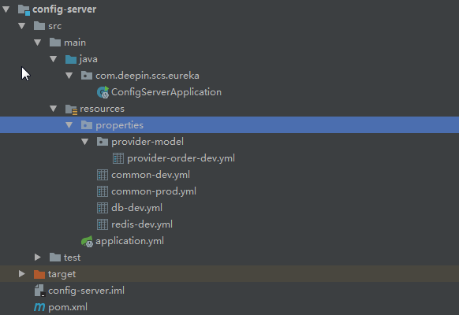
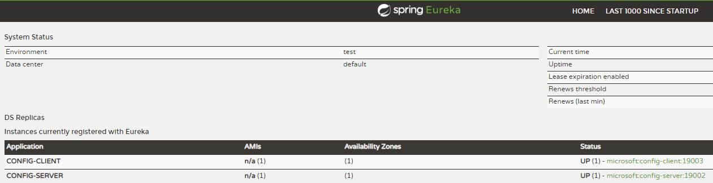
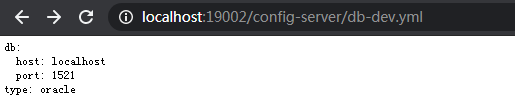
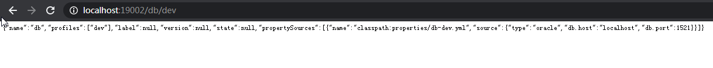
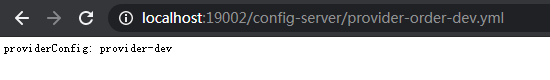
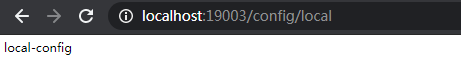
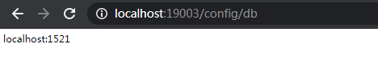
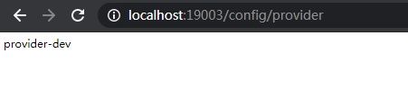

# Config搭建

## config server搭建

### pom.xml

> 注意引入spring-cloud-config-server

```xml
<?xml version="1.0" encoding="UTF-8"?>
<project xmlns="http://maven.apache.org/POM/4.0.0"
         xmlns:xsi="http://www.w3.org/2001/XMLSchema-instance"
         xsi:schemaLocation="http://maven.apache.org/POM/4.0.0 http://maven.apache.org/xsd/maven-4.0.0.xsd">
    <modelVersion>4.0.0</modelVersion>

    <groupId>com.deepin</groupId>
    <artifactId>config-server</artifactId>
    <version>0.0.1-SNAPSHOT</version>
    <packaging>jar</packaging>

    <parent>
        <groupId>org.springframework.boot</groupId>
        <artifactId>spring-boot-starter-parent</artifactId>
        <version>2.1.7.RELEASE</version> <!-- lookup parent from repository -->
        <relativePath/>
    </parent>

    <properties>
        <project.build.sourceEncoding>UTF-8</project.build.sourceEncoding>
        <java.version>1.8</java.version>
        <spring-cloud.version>Greenwich.SR1</spring-cloud.version>
    </properties>

    <dependencies>
        <dependency>
            <groupId>org.springframework.cloud</groupId>
            <artifactId>spring-cloud-starter-netflix-eureka-client</artifactId>
        </dependency>
        <dependency>
            <groupId>org.springframework.cloud</groupId>
            <artifactId>spring-cloud-config-server</artifactId>
        </dependency>
    </dependencies>

    <dependencyManagement>
        <dependencies>
            <dependency>
                <groupId>org.springframework.cloud</groupId>
                <artifactId>spring-cloud-dependencies</artifactId>
                <version>${spring-cloud.version}</version>
                <type>pom</type>
                <scope>import</scope>
            </dependency>
        </dependencies>
    </dependencyManagement>

    <build>
        <plugins>
            <plugin>
            <groupId>org.springframework.boot</groupId>
            <artifactId>spring-boot-maven-plugin</artifactId>
        </plugin>
        </plugins>
    </build>

    <repositories>
        <repository>
            <id>spring-milestones</id>
            <name>Spring Milestones</name>
            <url>https://repo.spring.io/milestone</url>
        </repository>
    </repositories>

</project>
```

### application.yml
> 这里使用本地配置文件的方式，Config默认支持Git方式
```yml
spring:
  application:
    name: config-server
  profiles:
    active: native # 使用本地配置文件的方式
  cloud:
    config:
      server:
        native:
          search-locations: classpath:properties/,classpath:properties/provider-model/ # 配置多个扫描路径

server:
  port: 19002

eureka:
  client:
    register-with-eureka: true
    fetch-registry: true
    service-url:
      defaultZone: http://localhost:18080/eureka/
```

### 本地配置文件



## ConfigServerApplication
```java
@SpringBootApplication
@EnableConfigServer
@EnableEurekaClient
public class ConfigServerApplication {
    public static void main(String[] args) {
        SpringApplication.run(ConfigServerApplication.class, args);
    }
}
```

## config client搭建

### pom.xml
> 注意添加spring-boot-starter-web和spring-cloud-config-client
```xml
<?xml version="1.0" encoding="UTF-8"?>
<project xmlns="http://maven.apache.org/POM/4.0.0"
         xmlns:xsi="http://www.w3.org/2001/XMLSchema-instance"
         xsi:schemaLocation="http://maven.apache.org/POM/4.0.0 http://maven.apache.org/xsd/maven-4.0.0.xsd">
    <modelVersion>4.0.0</modelVersion>

    <groupId>com.deepin</groupId>
    <artifactId>config-client</artifactId>
    <version>0.0.1-SNAPSHOT</version>
    <packaging>jar</packaging>

    <parent>
        <groupId>org.springframework.boot</groupId>
        <artifactId>spring-boot-starter-parent</artifactId>
        <version>2.1.7.RELEASE</version> <!-- lookup parent from repository -->
        <relativePath/>
    </parent>

    <properties>
        <project.build.sourceEncoding>UTF-8</project.build.sourceEncoding>
        <java.version>1.8</java.version>
        <spring-cloud.version>Greenwich.SR1</spring-cloud.version>
    </properties>

    <dependencies>
        <dependency>
            <groupId>org.springframework.boot</groupId>
            <artifactId>spring-boot-starter-web</artifactId>
        </dependency>
        <dependency>
            <groupId>org.springframework.cloud</groupId>
            <artifactId>spring-cloud-starter-netflix-eureka-client</artifactId>
        </dependency>
        <dependency>
            <groupId>org.springframework.cloud</groupId>
            <artifactId>spring-cloud-config-client</artifactId>
        </dependency>
    </dependencies>

    <dependencyManagement>
        <dependencies>
            <dependency>
                <groupId>org.springframework.cloud</groupId>
                <artifactId>spring-cloud-dependencies</artifactId>
                <version>${spring-cloud.version}</version>
                <type>pom</type>
                <scope>import</scope>
            </dependency>
        </dependencies>
    </dependencyManagement>

    <build>
        <plugins>
            <plugin>
            <groupId>org.springframework.boot</groupId>
            <artifactId>spring-boot-maven-plugin</artifactId>
        </plugin>
        </plugins>
    </build>

    <repositories>
        <repository>
            <id>spring-milestones</id>
            <name>Spring Milestones</name>
            <url>https://repo.spring.io/milestone</url>
        </repository>
    </repositories>

</project>
```
### bootstrap.yml
>bootstrap.yml 先加载， application.yml后加载。bootstrap.yml 用来程序引导时执行，应用于更加早期配置信息读取。可以理解成系统级别的一些参数配置，这些参数一般是不会变动的。一旦bootStrap.yml 被加载，则内容不会被覆盖。application.yml 可以用来定义应用级别的， 应用程序特有配置信息

```yml
spring:
  cloud:
    config:
      discovery:
        serviceId: config-server # 读取远程配置服务的ID
        enabled: true
      profile: dev # profile，常见的有dev, test, prod
      name: common,db,redis,provider-order # 读取哪些配置文件

eureka:
  client:
    register-with-eureka: true
    fetch-registry: true
    service-url:
      defaultZone: http://localhost:18080/eureka/
```

### application.yml
```yml
spring:
  application:
    name: config-client

server:
  port: 19003

localConfig: local-config # 测试用，对比读取本地配置和读取远程配置的效果是一样的
```

### ConfigClientApplication
```java
@SpringBootApplication
@EnableDiscoveryClient
public class ConfigClientApplication {
    public static void main(String[] args) {
        SpringApplication.run(ConfigClientApplication.class, args);
    }
}
```

### ReadConfigController
```java
@RestController
public class ReadConfigController {

    @Value("${localConfig}") // 自带application.yml中的配置项localConfig
    private String localConfig;

    @Value("${db.host}") // 配置中心db.yml中的配置项db.host
    private String dbHost;

    @Value("${db.port}") // 配置中心db.yml中的配置项db.host
    private String dbPort;

    @Value("${providerConfig}") // 配置中心provider-order.yml中的配置项providerConfig
    private String providerConfig;

    @RequestMapping("/config/local")
    public String getLocalConfig() {
        return localConfig;
    }

    @RequestMapping("/config/db")
    public String getDbConfig() {
        return dbHost + ":" + dbPort;
    }

    @RequestMapping("/config/provider")
    public String getProviderConfig() {
        return providerConfig;
    }
}
```

## 测试结果

- 启动eureka
- 启动config server
- 启动config client

> erueka注册情况：



> 通过浏览器查询config-server的db配置内容：http://localhost:19002/db-dev.yml





> 通过浏览器查询config-server的provider配置内容：http://localhost:19002/provider-order-dev.yml



> 注：url访问规则：
- http://ip:port/{label}/{name}-{profile}.yml
- http://ip:port/{name}-{profile}.yml
- http://ip:port/{label}/{name}-{profile}.properties
- http://ip:port/{name}-{profile}.properties
- http://ip:port/{name}/{profile}[/{label}]

> 通过测试RestController，查看config-client读取本地配置项： http://localhost:19003/config/local



> 通过测试RestController，查看config-client读取远程配置项： http://localhost:19003/config/db





