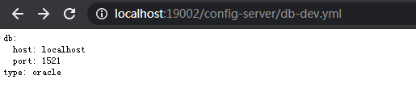

# Config集成Bus

## 原理
> 当配置中心服务中的配置变更后，如果不重启各个客户端服务，客户端服务无法获取到变更后的配置内容。

1. 当配置变更后，我们在注册中心configServer上调用刷新接口：默认为 http://ip:port/actuator/bus-refresh。bus/refresh是D版以前的接口，我们现在是基于G版的代码，默认已经变成了/actuator/bus-refresh
2. 注册中心configServer接收到刷新命令后，会把刷新消息广播到SpringCloud Bus消息总线
3. 其它各个服务会接受到SpringCloud Bus消息总线广播的刷新消息,
4. 各个服务重新从注册中心configServer上面拉取变更后的配置

## Config Server搭建

### pom.xml
> 注意添加spring-cloud-starter-bus-amqp
```xml
<?xml version="1.0" encoding="UTF-8"?>
<project xmlns="http://maven.apache.org/POM/4.0.0"
         xmlns:xsi="http://www.w3.org/2001/XMLSchema-instance"
         xsi:schemaLocation="http://maven.apache.org/POM/4.0.0 http://maven.apache.org/xsd/maven-4.0.0.xsd">
    <modelVersion>4.0.0</modelVersion>

    <groupId>com.deepin</groupId>
    <artifactId>config-server</artifactId>
    <version>0.0.1-SNAPSHOT</version>
    <packaging>jar</packaging>

    <parent>
        <groupId>org.springframework.boot</groupId>
        <artifactId>spring-boot-starter-parent</artifactId>
        <version>2.1.7.RELEASE</version> <!-- lookup parent from repository -->
        <relativePath/>
    </parent>

    <properties>
        <project.build.sourceEncoding>UTF-8</project.build.sourceEncoding>
        <java.version>1.8</java.version>
        <spring-cloud.version>Greenwich.SR1</spring-cloud.version>
    </properties>

    <dependencies>
        <dependency>
            <groupId>org.springframework.cloud</groupId>
            <artifactId>spring-cloud-starter-netflix-eureka-client</artifactId>
        </dependency>
        <dependency>
            <groupId>org.springframework.cloud</groupId>
            <artifactId>spring-cloud-config-server</artifactId>
        </dependency>
        <!-- 集成BUS -->
        <dependency>
            <groupId>org.springframework.cloud</groupId>
            <artifactId>spring-cloud-starter-bus-amqp</artifactId>
        </dependency>
    </dependencies>

    <dependencyManagement>
        <dependencies>
            <dependency>
                <groupId>org.springframework.cloud</groupId>
                <artifactId>spring-cloud-dependencies</artifactId>
                <version>${spring-cloud.version}</version>
                <type>pom</type>
                <scope>import</scope>
            </dependency>
        </dependencies>
    </dependencyManagement>

    <build>
        <plugins>
            <plugin>
            <groupId>org.springframework.boot</groupId>
            <artifactId>spring-boot-maven-plugin</artifactId>
        </plugin>
        </plugins>
    </build>

    <repositories>
        <repository>
            <id>spring-milestones</id>
            <name>Spring Milestones</name>
            <url>https://repo.spring.io/milestone</url>
        </repository>
    </repositories>

</project>
```

### applicaton.yml
注意：
- search-locations生产环境下应该配置相对路径或绝对路径，配置文件放置classpath下会打到jar包里，就没办法修改配置文件了
- 添加了rabbitmq配置，记得rabbitmq服务器上要开放5672这个通信端口
- include: "*"打开所有的端点，使能调用bus-refreash接口
```yml
spring:
  application:
    name: config-server
  profiles:
    active: native # 使用本地配置文件的方式
  cloud:
    config:
      server:
        native:
          search-locations: classpath:properties/,classpath:properties/provider-model/ # 配置多个扫描路径
  rabbitmq:
    host: 192.168.150.120
    port: 5672
    username: admin
    password: 123456

management:
  endpoints:
    web:
      exposure:
        include: "*"

server:
  port: 19002

eureka:
  client:
    register-with-eureka: true
    fetch-registry: true
    service-url:
      defaultZone: http://localhost:18080/eureka/
```
### ConfigServerApplication
```java
@SpringBootApplication
@EnableConfigServer
@EnableEurekaClient
public class ConfigServerApplication {
    public static void main(String[] args) {
        SpringApplication.run(ConfigServerApplication.class, args);
    }
}
```

## Config Client搭建

### pom.xml
> 注意开启spring-cloud-starter-bus-amqp,spring-boot-starter-actuator
```xml
<?xml version="1.0" encoding="UTF-8"?>
<project xmlns="http://maven.apache.org/POM/4.0.0"
         xmlns:xsi="http://www.w3.org/2001/XMLSchema-instance"
         xsi:schemaLocation="http://maven.apache.org/POM/4.0.0 http://maven.apache.org/xsd/maven-4.0.0.xsd">
    <modelVersion>4.0.0</modelVersion>

    <groupId>com.deepin</groupId>
    <artifactId>config-client</artifactId>
    <version>0.0.1-SNAPSHOT</version>
    <packaging>jar</packaging>

    <parent>
        <groupId>org.springframework.boot</groupId>
        <artifactId>spring-boot-starter-parent</artifactId>
        <version>2.1.7.RELEASE</version> <!-- lookup parent from repository -->
        <relativePath/>
    </parent>

    <properties>
        <project.build.sourceEncoding>UTF-8</project.build.sourceEncoding>
        <java.version>1.8</java.version>
        <spring-cloud.version>Greenwich.SR1</spring-cloud.version>
    </properties>

    <dependencies>
        <dependency>
            <groupId>org.springframework.boot</groupId>
            <artifactId>spring-boot-starter-web</artifactId>
        </dependency>
        <dependency>
            <groupId>org.springframework.cloud</groupId>
            <artifactId>spring-cloud-starter-netflix-eureka-client</artifactId>
        </dependency>
        <dependency>
            <groupId>org.springframework.cloud</groupId>
            <artifactId>spring-cloud-config-client</artifactId>
        </dependency>
        <!-- 集成BUS -->
        <dependency>
            <groupId>org.springframework.cloud</groupId>
            <artifactId>spring-cloud-starter-bus-amqp</artifactId>
        </dependency>
        <dependency>
            <groupId>org.springframework.boot</groupId>
            <artifactId>spring-boot-starter-actuator</artifactId>
        </dependency>
    </dependencies>

    <dependencyManagement>
        <dependencies>
            <dependency>
                <groupId>org.springframework.cloud</groupId>
                <artifactId>spring-cloud-dependencies</artifactId>
                <version>${spring-cloud.version}</version>
                <type>pom</type>
                <scope>import</scope>
            </dependency>
        </dependencies>
    </dependencyManagement>

    <build>
        <plugins>
            <plugin>
            <groupId>org.springframework.boot</groupId>
            <artifactId>spring-boot-maven-plugin</artifactId>
        </plugin>
        </plugins>
    </build>

    <repositories>
        <repository>
            <id>spring-milestones</id>
            <name>Spring Milestones</name>
            <url>https://repo.spring.io/milestone</url>
        </repository>
    </repositories>

</project>
```

### bootstrap.yml
```yml
spring:
  cloud:
    config:
      discovery:
        serviceId: config-server # 读取远程配置服务的ID
        enabled: true
      label: properties
      name: common,db,redis,provider-order # 读取哪些配置文件
      profile: dev # profile，常见的有dev, test, prod

eureka:
  client:
    register-with-eureka: true
    fetch-registry: true
    service-url:
      defaultZone: http://localhost:18080/eureka/
```

### application.yml
> 注意添加rabbitmq相关配置和打开所有端点
```yml
spring:
  application:
    name: config-client
    bus:
      trace:
        enabled: true
  rabbitmq:
    host: 192.168.150.120
    port: 5672
    username: admin
    password: 123456

management:
  endpoints:
    web:
      exposure:
        include: "*"

server:
  port: 19003

localConfig: local-config # 测试用，对比读取本地配置和读取远程配置的效果是一样的
```

### ConfigClientApplication
```java
@SpringBootApplication
@EnableDiscoveryClient
public class ConfigClientApplication {
    public static void main(String[] args) {
        SpringApplication.run(ConfigClientApplication.class, args);
    }
}

```

### ReadConfigController
> 注意添加@RefreshScope配置文件刷新注解
```java
@RestController
@RefreshScope
public class ReadConfigController {

    @Value("${localConfig}") // 自带application.yml中的配置项localConfig
    private String localConfig;


    @Value("${db.host}") // 配置中心db.yml中的配置项db.host
    private String dbHost;

    @Value("${db.port}") // 配置中心db.yml中的配置项db.host
    private String dbPort;

    @Value("${providerConfig}") // 配置中心provider-order.yml中的配置项providerConfig
    private String providerConfig;

    @RequestMapping("/config/local")
    public String getLocalConfig() {
        return localConfig;
    }

    @RequestMapping("/config/db")
    public String getDbConfig() {
        return dbHost + ":" + dbPort;
    }

    @RequestMapping("/config/provider")
    public String getProviderConfig() {
        return providerConfig;
    }
}
```

## 测试结果

- 启动eureka
- 启动config server
- 启动config client

> erueka注册情况：


> 通过浏览器查询config-server的db配置内容：http://localhost:19002/db-dev.yml



> 通过测试RestController，查看config-client读取远程配置项： http://localhost:19003/config/db


> 将db.yml中的配置项db.port改为11521, 刷新浏览器查看config-server的db-dev.yml已经更新了（如果是在idea中测试，注意recompile下db.yml，否则配置不会更新。如果以jar包方式运行config-server并且扫描路径是操作系统的路径，则config-server会自动感知到配置更新）。此时config-client还不知道配置已经更新


> 使用POSTMAN发送http://localhost:19002/actuator/bus-refresh 接口


> 刷新浏览器，查看config-client读取远程配置项已经更新： http://localhost:19003/config/db


## 局部刷新

某些场景下（例如灰度发布），我们可能只想刷新部分微服务的配置，此时可通过config-clent的actuator/bus-refresh来手动刷新自己的配置。或者通过config-server的定点刷新来实现：
/actuator/bus-refresh?destination=client:port
```
curl -X POST http://localhost:19002/actuator/bus-refresh?destination=config-client:19003
```