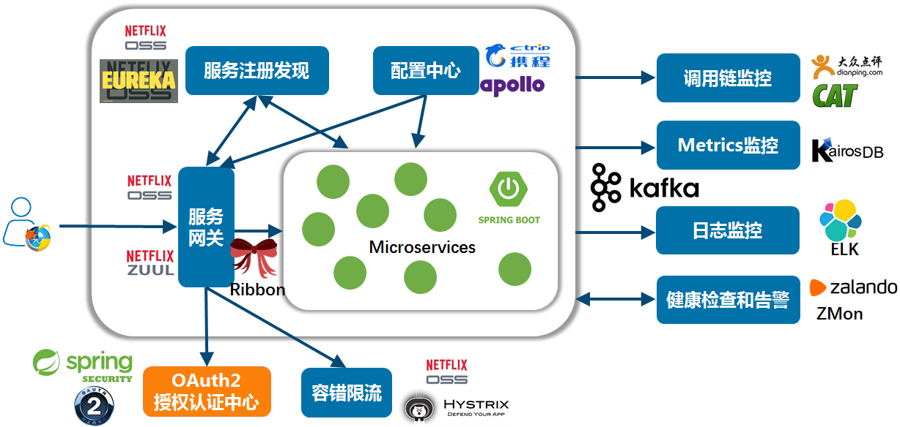

# SpringCloud介绍

## 为什么需要学习 SpringCloud ？
不论是商业应用还是用户应用，在业务初期都很简单，我们通常会把它实现为单体结构的应用。但是，随着业务逐渐发展，产品思想会变得越来越复杂，单体结构的应用也会越来越复杂。这就会给应用带来如下的几个问题:

- 代码结构混乱：业务复杂，导致代码量很大，管理会越来越困难。同时，这也会给业务的快速迭代带来巨大挑战；
- 开发效率变低：开发人员同时开发一套代码，很难避免代码冲突。开发过程会伴随着不断解决冲突的过程，这会严重的影响开发效率；
- 排查解决问题成本高：线上业务发现 bug，修复 bug 的过程可能很简单。但是，由于只有一套代码，需要重新编译、打包、上线，成本很高。

由于单体结构的应用随着系统复杂度的增高，会暴露出各种各样的问题。近些年来，微服务架构逐渐取代了单体架构，且这种趋势将会越来越流行。SpringCloud 是目前最常用的微服务开发框架，已经在企业级开发中大量的应用。
    SpringCloud 基于 SpringBoot， 提供了一整套微服务解决方案，包含了众多组件（基础功能）：

- Spring Cloud Netflix：核心组件，可以对多个Netflix OSS开源套件进行整合，包括以下几个组件：
   - 服务注册与发现： Spring Cloud Eureka
微服务开发框架最核心的功能之一，实现了对微服务的治理。根据提供的功能，把系统中的微服务划分为两个角色：Eureka Server 和 Eureka Client。

   - 微服务调用与负载均衡： Spring Cloud Ribbon
通过 Spring 封装好的工具类实现了微服务之间的调用，且多实例的情况下，默认采用轮询的访问策略。

   - 服务容错保护： Spring Cloud Hystrix
实现了断路器、线程隔离等一系列服务保护功能。当某个服务单元发生故障之后，通过断路器的故障监控，向调用方返回一个错误响应， 而不是长时间的等待。且它会为每一个依赖服务创建一个独立的线程池，这样就算某个依赖服务出现延迟过高的情况，也只是对该依赖服务的调用产生影响， 而不会拖慢其他的依赖服务。

   - 声明式服务调用： Spring Cloud Feign
整合了 Spring Cloud Ribbon 与 Spring Cloud Hystrix，Feign 是一种声明式、模板化的 HTTP 客户端。在 Spring Cloud 中使用 Feign，我们可以做到使用 HTTP 请求远程服务时能与调用本地方法一样的编码体验，开发者完全感知不到这是远程方法，更感知不到这是个HTTP请求。

   - 网关服务：Spring Cloud Zuul
提供了系统的统一访问入口，实现了路由匹配的功能。这样，系统中的各个微服务对客户端来说就是透明的，不需要知道所有微服务的组织结构。降低了客户端实现难度的同时，也使得整个微服务系统结构更加清晰。

   - Archaius：外部化配置组件

- Spring Cloud Config：配置管理工具，实现应用配置的外部化存储，支持客户端配置信息刷新、加密/解密配置内容等。

- Spring Cloud Bus：事件、消息总线，用于传播集群中的状态变化或事件，以及触发后续的处理

- Spring Cloud Stream：消息驱动，消息中间件组件，它集成了 kafka 和 rabbitmq

- Spring Cloud Security：基于spring security的安全工具包，为我们的应用程序添加安全控制

- Spring Cloud Consul : 封装了Consul操作，Consul是一个服务发现与配置工具（与Eureka作用类似），与Docker容器可以无缝集成

- spring cloud sleuth：服务跟踪。当我们需要查看服务日志时，不应该是一个实例一个实例的去看，而应该是集成到一个文件中的，sleuth就可以干这事情

- ......

