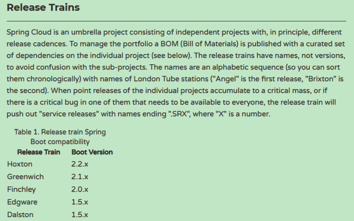

# SpringCloud和SpringBoot版本对应关系

> 查看地址：https://spring.io/projects/spring-cloud

> 版本号说明

- 大版本号实际上首字母是有顺序的，比如：Dalston版本，我们可以简称 D 版本，对应的 Edgware 版本我们可以简称 E 版本。
- Spring Cloud 小版本分为：
   - SNAPSHOT： 快照版本，随时可能修改
   - M： MileStone，M1表示第1个里程碑版本，一般同时标注PRE，表示预览版版。
   - SR： Service Release，SR1表示第1个正式版本，一般同时标注GA：(GenerallyAvailable),表示稳定版本。
