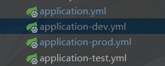

# application.yml 多环境配置

## 配置文件多环境配置
```
spring:
    # 环境 dev:开发环境|test:测试环境|prod:生产环境
    profiles:
        active: dev #激活的配置文件
```



> 值得注意的一点在激活application-dev.yml时若其中存在application.yml同名配置时后者的配置属性会被覆盖（即激活配置文件优先级高于总配置文件）