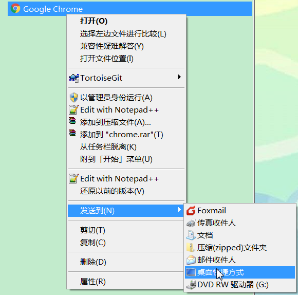
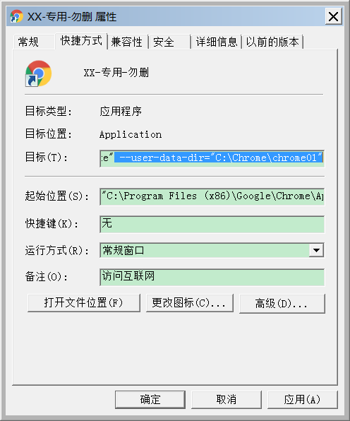
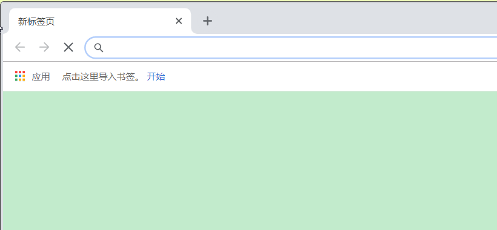

# Chrome使用

## 下载

```
https://www.google.cn/chrome/?standalone=1&platform=win64
```

## 远程桌面多用户同时使用
> 当多个用户(使用同一个用户名)同时远程桌面连接到Windows Server 2008/2012，其中一个用户打开了Chrome浏览器，那么另一个用户下就无法打开Chrome浏览器了。

1. 新建Chrome快捷方式：新建Chrome快捷方式，为防止被删除，可以改名并挪到安全的文件夹位置



2. 快捷方式添加参数：在目标中追加参数形如 --user-data-dir="C:\Users\chrome01"指向新的用户数据文件夹，确定



3 打开Chrome快捷方式：新的Chrome里没有任何的配置，可以定义新的书签和插件


